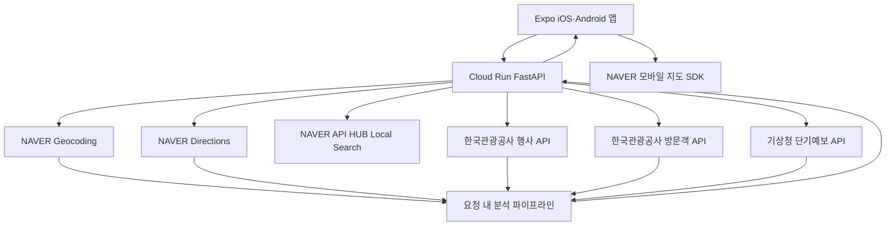
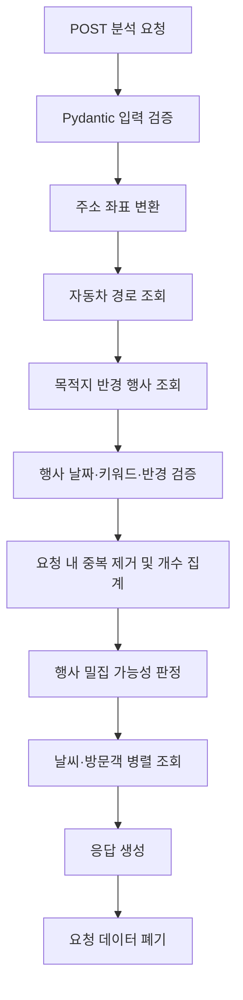

# 여행계획 목적지 주변 행사 밀집 가능성 분석 서비스 PRD

- 상태: MVP 구현·iOS Simulator 실연동 검증 완료, 배포 전 검증 대기
- 작성 기준일: 2026-08-20
- 문서 목적: 사용자의 여행계획을 저장하지 않고, 목적지 주변 행사 개수·방문객 참고값·날씨를 조합해 행사 밀집 가능성을 안내하는 모바일 앱의 제품 및 시스템 요구사항 정의

## 1. 제품 개요

사용자가 여행일, 출발지, 여행지를 입력하면 목적지 좌표 반경 15km에서 해당 날짜에 열리는 축제·공연·행사 후보 개수를 센다. `서울역`, `부산역`처럼 장소명만 입력한 경우에는 NAVER 지역 검색 후보에서 도로명 주소를 선택해 분석에 사용한다. 지역 방문객 통계와 날씨 예보를 함께 조회하고, 목적지 주변 행사 밀집 가능성을 근거와 함께 설명한다.

이 서비스는 과거 특정 도로의 실제 교통량이나 지연시간을 재현하지 않는다. 행사 위치와 자동차 이동 경로의 공간적 겹침을 이용해 교통 수요 증가 가능성을 알려주는 여행 의사결정 보조 서비스다.

제품은 Android와 iOS 앱으로 배포한다. 앱은 React Native와 Expo로 개발하고, 분석 백엔드는 FastAPI 컨테이너를 Google Cloud Run에 배포한다.

## 2. 확정된 제품·아키텍처 원칙

### 2.1 모바일 앱 우선

- Android와 iOS 앱을 동일한 React Native·Expo 코드베이스로 개발한다.
- 웹 사용자용 제품 화면은 MVP에 포함하지 않는다.
- 지도 표시에는 모바일 지도 SDK를 사용한다.
- 앱 빌드와 스토어 제출에는 EAS Build와 EAS Submit을 사용한다.

### 2.2 Stateless 백엔드

- 백엔드는 Python과 FastAPI로 구현한다.
- FastAPI 컨테이너는 Google Cloud Run에 배포한다.
- 서버는 요청을 처리하는 동안에만 사용자 입력과 분석 데이터를 메모리에서 사용한다.
- 요청 처리가 끝나면 출발지, 여행지, 여행일, 좌표, 경로 및 분석 결과를 보관하지 않는다.
- 사용자 데이터 저장을 위한 데이터베이스를 사용하지 않는다.
- Supabase, Cloud SQL, Firestore, Redis 및 영구 캐시는 사용하지 않는다.

### 2.3 Google Cloud 사용 범위

- 애플리케이션 실행 환경으로 Cloud Run만 사용한다.
- API 키는 Cloud Run Revision의 일반 환경변수로 주입한다.
- Google Secret Manager는 사용하지 않는다.
- Cloud Run 외의 Google Cloud 애플리케이션 서비스에 제품 기능을 의존하지 않는다.
- 컨테이너 이미지의 빌드·보관 방식은 배포 환경에서 별도로 결정할 수 있으나 런타임 제품 구조에는 포함하지 않는다.

### 2.4 데이터 비저장

- 회원가입과 로그인을 제공하지 않는다.
- 사용자의 여행계획을 서버나 앱의 영구 저장소에 저장하지 않는다.
- 분석 결과 재조회, 저장한 여행 및 기기 간 동기화를 제공하지 않는다.
- 앱이 종료되면 입력과 결과는 사라진다.
- 사용자 입력, 좌표, 경로 및 분석 결과를 애플리케이션 로그에 남기지 않는다.

## 3. 문제와 목표

### 문제

- 한국관광공사 API만으로는 등록된 행사만 확인할 수 있다.
- 행사 정보와 사용자의 자동차 이동 경로가 같은 이동축에 있는지 직접 판단해야 한다.
- 지역 방문객 수와 날씨는 행사 정보와 별도의 API에서 조회해야 한다.
- 검색 결과에는 일정이 오래되었거나 중복된 행사가 포함될 수 있다.
- 목적지 반경 검색과 행사 후보 개수의 호출량을 통제해야 한다.

### 목표

- 여행일에 개최 중인 목적지 주변 행사 후보 개수를 찾는다.
- 행사 날짜·키워드·좌표를 요청 안에서 재검증한다.
- 행사 개수로 목적지 주변 행사 밀집 가능성을 계산한다.
- 행사 개수·방문객·날씨 정보를 근거와 함께 보여준다.
- 결과를 “교통 지연시간”이 아니라 “행사 밀집 가능성”으로 표현한다.
- 외부 API 일부가 실패해도 가능한 결과를 부분적으로 제공한다.
- 사용자 입력과 분석 결과를 영구 저장하지 않는다.

### 비목표

- 실제 도로 교통량 또는 평균속도 예측
- 행사로 인한 실제 지연시간 산출
- 사용자 여행 이력 저장
- 사용자 계정 및 개인화
- 모든 외부 행사 웹사이트의 자동 수집
- 장기간 유지되는 행사 데이터베이스 구축

## 4. 사용자 시나리오

1. 사용자가 앱에서 여행일, 출발지, 여행지와 선택 입력값을 입력한다.
2. 장소명이면 앱이 NAVER 지역 검색 후보를 조회하고 사용자가 주소 후보를 선택한다.
3. 앱이 정규화된 입력값과 클라이언트 플랫폼을 Cloud Run 분석 API로 전송한다.
4. FastAPI가 주소를 좌표로 변환하고 자동차 경로를 조회한다.
5. 목적지 좌표를 중심으로 기본 반경 15km의 축제·공연·행사를 한 번 조회한다.
6. 후보 행사의 날짜·키워드·중복·목적지 반경 조건을 현재 요청 안에서 검증한다.
7. 조건을 통과한 행사 개수로 목적지 주변 행사 밀집 가능성을 계산한다.
8. 지역 방문객 참고값과 여행일 날씨를 함께 조회한다.
9. FastAPI가 분석 결과를 앱에 반환한다.
10. 앱이 지도, 행사 개수, 행사 밀집 가능성, 방문객·날씨 및 경고를 표시한다.
11. 요청 처리 종료 후 서버는 사용자 입력과 분석 결과를 보관하지 않는다.

## 5. 입력과 출력

### 입력

| 필드                      |   필수 | 설명                                                     |
| ------------------------- | -----: | -------------------------------------------------------- |
| `travelDate`              |     예 | 여행일, `YYYY-MM-DD`                                     |
| `origin`                  |     예 | 출발지 주소 또는 좌표                                    |
| `destination`             |     예 | 여행지 주소 또는 좌표                                    |
| `departureTime`           | 아니오 | 경로 조회와 안내 문구에 사용할 출발 예정 시각            |
| `clientPlatform`          |     예 | `IOS` 또는 `AND`                                         |
| `routeBufferMeters`       | 아니오 | 이전 계약 호환 필드이며 현재 행사 검색에는 사용하지 않음 |
| `destinationRadiusMeters` | 아니오 | 목적지 주변 행사 검색 거리, 기본값 15,000m               |
| `eventKeywords`           | 아니오 | 축제, 공연, 스포츠 등 관심 유형                          |

### 출력

- 자동차 경로 요약 및 지도 표시용 좌표 또는 폴리라인
- 여행일에 개최 중인 목적지 주변 행사 후보 개수
- 행사 개수 기반 목적지 주변 행사 밀집 가능성
- 후속 단계에서 조회할 행사 상세정보의 자리
- 지역 방문객 참고값
- 여행일 날씨 예보 또는 예보 제공 불가 안내
- 장소명 검색 후보와 선택 가능한 도로명 주소
- 근거가 포함된 행사 밀집 가능성 등급
- 데이터가 부족하거나 조회에 실패한 항목에 대한 경고
- 응답 생성 시각

## 6. API와 데이터 소스

### 6.1 한국관광공사 국문 관광정보 API

기본 행사 데이터는 [한국관광공사 국문 관광정보 서비스](https://www.data.go.kr/data/15101578/openapi.do?recommendDataYn=Y)를 사용한다. 상세 명세는 [`visitkorea_openapi_docs/한국관광공사_국문 관광정보 서비스.md`](../visitkorea_openapi_docs/한국관광공사_국문%20관광정보%20서비스.md)를 참조한다.

| API                  | 역할                             | 주요 필드·조건                                    |
| -------------------- | -------------------------------- | ------------------------------------------------- |
| `locationBasedList2` | 목적지 좌표 주변 행사 후보 검색  | `contentTypeId=15`, `mapX`, `mapY`, `radius=15km` |
| `searchFestival2`    | 후속 범위로 보류                 | 현재 MVP 분석에서는 호출하지 않음                 |
| `detailCommon2`      | 후속 단계에서 행사 기본정보 보완 | 주소, 좌표, 소개, 연락처, 원문 링크               |
| `detailIntro2`       | 후속 단계에서 행사 운영정보 보완 | 행사 시작·종료일, 행사장소, 운영시간, 홈페이지    |

목적지 반경 검색 결과에는 여행일과 다른 기간의 후보가 포함될 수 있으므로 FastAPI에서 다음 조건으로 재검증한 뒤 개수를 센다.

```text
event.startDate <= travelDate <= event.endDate
```

관광공사 API의 `MobileOS`에는 앱이 전달한 `clientPlatform`을 검증해 `IOS` 또는 `AND`로 전달하고, `MobileApp`에는 실제 서비스명을 전달한다.

관광공사 API는 모바일 직접 호출이 가능하지만 다음 이유로 FastAPI가 대신 호출한다.

- API 키를 앱 바이너리에 포함하지 않기 위해
- 목적지 반경과 후보 개수를 중앙에서 제한하기 위해
- 날짜 검증·키워드 필터·중복 제거를 한 요청에서 처리하기 위해
- 외부 API 실패를 항목별로 처리하기 위해

### 6.2 한국관광공사 방문객 참고값

| API                     | 역할                         | 주의사항                          |
| ----------------------- | ---------------------------- | --------------------------------- |
| `metcoRegnVisitrDDList` | 시도 단위 방문객 참고값      | 미래 예측값으로 표현하지 않음     |
| `locgoRegnVisitrDDList` | 시군구 단위 방문객 참고값    | 기준일과 지역을 함께 표시         |
| `tatsCnctrRatedList`    | 향후 30일 관광지 집중률 참고 | 절대 방문객 수가 아닌 상대 집중률 |

방문객 데이터는 현재 요청 안에서 조회하고 응답에 포함한 후 저장하지 않는다.

### 6.3 기상청 단기예보 API

[기상청 단기예보 API](https://www.data.go.kr/data/15084084/openapi.do)를 사용해 여행지 격자 또는 인근 지점의 예보를 조회한다.

- 예보 가능 기간 안에서는 날짜·시간대별 예보를 표시한다.
- 예보 가능 기간을 벗어나면 특정 날짜의 날씨를 확정적으로 말하지 않는다.
- 장기 여행계획에는 “예보가 아직 발표되지 않음”을 표시한다.
- 날씨 API 실패가 전체 여행 분석 실패로 이어지지 않도록 한다.

### 6.4 NAVER Maps

지도 표시에는 NAVER 모바일 지도 SDK를 사용한다. 지도 SDK용 Application에는 Android 패키지 이름과 iOS Bundle ID를 등록한다.

FastAPI에서는 NAVER Maps REST API를 사용한다.

- Geocoding: 주소를 좌표로 변환
- Directions: 자동차 경로, 총 거리, 예상시간 및 경로 좌표 조회
- Reverse Geocoding: 필요한 경우 좌표를 행정구역으로 변환
- NAVER API HUB Local Search: `서울역`, `부산역` 같은 장소명 후보와 주소·좌표 조회

Maps REST와 NAVER API HUB는 애플리케이션별 인증정보를 분리한다. Maps 인증정보는 `NCP_MAPS_CLIENT_ID`·`NCP_MAPS_CLIENT_SECRET`, Local Search 인증정보는 `NCP_LOCAL_SEARCH_CLIENT_ID`·`NCP_LOCAL_SEARCH_CLIENT_SECRET`로 Cloud Run 환경변수에 보관하고 앱에 포함하지 않는다. Local Search 응답의 `mapx`·`mapy`가 10⁷배 정수 형식인 경우 백엔드가 WGS84 십진수로 변환한다.

### 6.5 외부 공식 행사 웹페이지

MVP에서는 인터넷 전체를 탐색하거나 다수 사이트를 자동 크롤링하지 않는다.

- 관광공사 응답에 공식 홈페이지 URL이 있으면 결과에 표시한다.
- 공식 홈페이지의 내용을 장기간 저장하거나 변경 이력을 관리하지 않는다.
- 요청 중 공식 페이지 확인이 필요하면 허용된 소수의 출처에 한해 제한적으로 수행한다.
- 원문 확인 실패가 전체 분석 실패로 이어지지 않도록 한다.
- 일반 검색 결과 제목이나 요약문만으로 행사를 확정하지 않는다.

## 7. 시스템 구성



### 모바일 앱 역할

- 여행일·출발지·여행지 입력 UI
- 장소명 검색 후보 표시와 도로명 주소 선택 UI
- 입력값의 1차 형식 검증
- 클라이언트 플랫폼 전달
- 분석 요청 및 로딩·오류 상태 표시
- 지도에 경로와 행사 마커 표시
- 행사 개수, 날씨, 방문객 및 행사 밀집 가능성 표시
- 출처 링크를 외부 브라우저로 열기
- 화면이 살아 있는 동안에만 입력과 결과 유지

### FastAPI 역할

- API 키 보관 및 외부 요청 대행
- 사용자 입력의 최종 검증
- 주소 좌표 변환과 자동차 경로 조회
- 장소명 입력 시 NAVER 지역 검색 후보·주소·좌표 정규화
- 목적지 반경 행사 검색 및 호출량 제한
- 외부 API 병렬 호출과 타임아웃 처리
- API 응답 정규화
- 행사 날짜 검증과 요청 내 중복 제거
- 행사장과 목적지 사이 거리 계산
- 방문객·날씨·행사 결과 조합
- 혼잡 가능성 판정
- 키와 사용자 입력이 포함되지 않은 운영 로그 생성

## 8. 모바일 앱 화면

```text
앱
├── 홈
│   ├── 여행일 입력
│   ├── 출발지 입력
│   ├── 여행지 입력
│   ├── 출발 예정 시각
│   └── 관심 행사 유형
├── 분석 진행
│   ├── 경로 조회 중
│   ├── 행사 검색 중
│   └── 날씨·방문객 조회 중
├── 분석 결과
│   ├── 행사 밀집 가능성 요약
│   ├── 자동차 경로 지도
│   ├── 목적지 주변 행사
│   ├── 방문객 참고값
│   ├── 날씨
│   └── 데이터 한계와 경고
└── 행사 상세
    ├── 행사 기간·장소
    ├── 경로와 거리
    ├── 신뢰도
    └── 공식 출처 링크
```

MVP에서는 저장한 여행, 최근 검색, 오프라인 결과 및 서버 푸시 알림 화면을 제공하지 않는다.

## 9. 분석 처리 흐름



### 9.1 목적지 행사 검색

행사 검색은 경로 전체를 샘플링하지 않는다. 자동차 경로는 지도 표시와 거리·시간 정보에만 사용하고, 기본값 기준 `locationBasedList2`는 목적지 좌표에서 15km 반경으로 한 번 호출한다. 요청의 `destinationRadiusMeters`는 1~20km 범위에서 조정할 수 있지만 모바일 기본 요청은 15km다. 결과는 현재 요청 안에서 `contentId` 또는 정규화 키로 합친 뒤 행사 개수만 응답한다.

### 9.2 장소명 입력과 주소 정규화

- 모바일 입력창은 2자 이상 장소명을 300ms debounce 후 `GET /api/v1/locations/suggestions`로 조회한다.
- 후보에는 장소명, 지번 주소, 도로명 주소와 WGS84 좌표가 포함된다.
- 사용자가 후보를 선택하면 도로명 주소를 입력값으로 대체해 분석 요청에 사용한다.
- 후보가 여러 개인 장소명은 잘못된 역·시설을 임의 선택하지 않도록 선택을 요구한다. 후보를 선택하지 않고 모호한 장소명을 그대로 제출하면 `LOCATION_NOT_FOUND`가 반환될 수 있다.
- 숫자가 포함된 완성형 도로명 주소는 불필요한 추천 호출을 생략하고 기존 Geocoding을 사용한다.

### 9.3 행사 날짜 검증

- 관광공사 행사: `eventstartdate`, `eventenddate` 확인
- 여행일이 행사 기간에 포함되지 않으면 제외
- 종료일이 없는 행사는 시작일 당일 행사로만 취급하거나 `확인 필요`로 표시
- 취소·변경 상태가 현재 응답에서 확인되면 해당 상태를 반영
- 과거 분석 결과와 비교한 변경 추적은 수행하지 않음

### 9.4 목적지 주변 판정

초기 기본값은 다음과 같다.

- 목적지 주변: 15km
- `locationBasedList2` 단일 호출 반경: 15km

행사장 좌표가 목적지에서 설정된 `destinationRadiusMeters` 이내인 행사만 목적지 주변 행사로 분류한다. 기본값은 15km이며, 이 거리는 교통 지연을 계산하는 값이 아니라 행사 탐색 범위다. 현재 단계에서는 이 조건을 통과한 행사 개수만 응답하고, 행사별 상세정보·지도 마커는 후속 단계에서 제공한다.

공간 계산에는 Shapely와 PyProj를 사용한다. 경위도 좌표를 거리 계산에 적절한 좌표계로 변환한 후 행사 지점과 경로 선 사이의 거리를 미터 단위로 계산한다.

### 9.5 중복 행사 제거

현재 분석 요청에 포함된 행사만 다음 순서로 중복 제거한다.

1. 동일한 공식 콘텐츠 ID
2. 동일한 원문 URL
3. 행사명 정규화 + 시작일 + 장소명
4. 행사명 유사도 + 날짜 겹침 + 좌표 거리

중복 제거 결과는 서버에 저장하지 않는다.

## 10. 런타임 행사 데이터 모델

한국관광공사 및 제한적으로 확인한 공식 페이지 결과를 요청 처리 중 다음 형태로 정규화한다.

```json
{
  "id": "runtime-canonical-event-id",
  "title": "행사명",
  "startDate": "2026-10-01",
  "endDate": "2026-10-03",
  "venue": "행사장",
  "address": "행사장 주소",
  "lat": 35.123,
  "lon": 129.123,
  "eventType": "festival",
  "keywords": ["축제", "공연"],
  "sourceType": "visitkorea|local-gov|organizer",
  "sourceUrl": "https://example.com/event",
  "sourceName": "출처명",
  "confidence": "high|medium|low",
  "status": "confirmed|candidate|changed|cancelled",
  "distanceToRouteMeters": null,
  "distanceToDestinationMeters": 4800,
  "checkedAt": "2026-08-06T12:00:00+09:00"
}
```

`id`는 현재 응답 안에서 행사를 구분하기 위한 값이다. `checkedAt`은 현재 요청에서 확인한 시각이며 데이터베이스에 저장하지 않는다.

## 11. 목적지 주변 행사 밀집 가능성 판정

현재 단계의 등급은 행사 개수만 사용하는 밀집 가능성 안내이며, 정량적인 교통 예측값이 아니다.

| 등급      | 기본 조건                                               |
| --------- | ------------------------------------------------------- |
| 높음      | 여행일·키워드·목적지 반경 조건을 통과한 후보가 6개 이상 |
| 보통      | 조건을 통과한 후보가 3~5개                              |
| 낮음      | 조건을 통과한 후보가 0~2개                              |
| 확인 필요 | 행사 제공자 응답 실패로 개수를 확인하지 못함            |

사용자에게는 다음과 같이 설명한다.

```text
여행일과 겹치는 목적지 반경 15km 내 행사 후보가 6개 확인되었습니다.
목적지 주변 행사 밀집 가능성이 높습니다.
행사별 상세정보와 실제 지연시간은 아직 제공되지 않습니다.
```

## 12. FastAPI 초안

### `POST /api/v1/travel-plan/analyze`

요청은 동기 방식으로 처리하고 현재 요청에 대한 전체 분석 결과를 반환한다. 데이터베이스가 없으므로 작업 ID 기반 재조회 API는 제공하지 않는다.

요청 예시:

```json
{
  "travelDate": "2026-10-03",
  "origin": "서울역",
  "destination": "부산 해운대",
  "departureTime": "08:00",
  "clientPlatform": "IOS",
  "routeBufferMeters": 10000,
  "destinationRadiusMeters": 15000,
  "eventKeywords": ["축제", "공연"]
}
```

응답 예시:

```json
{
  "travelDate": "2026-10-03",
  "route": {
    "distanceMeters": 400000,
    "durationSeconds": 18000,
    "polyline": []
  },
  "congestion": {
    "level": "high",
    "reasons": [
      "여행일과 공식 축제 기간이 겹칩니다.",
      "행사장이 목적지에서 약 4.8km 떨어져 있습니다."
    ]
  },
  "events": [
    {
      "id": "runtime-event-id",
      "title": "지역 축제",
      "startDate": "2026-10-01",
      "endDate": "2026-10-10",
      "venue": "축제 장소",
      "distanceToRouteMeters": null,
      "confidence": "high",
      "congestionSignal": "high",
      "sourceUrl": "https://example.com/event",
      "checkedAt": "2026-08-06T12:00:00+09:00"
    }
  ],
  "visitorReference": {
    "referenceDate": "2025-10-03",
    "region": "부산 해운대구",
    "visitorCount": 0,
    "note": "과거 참고값이며 미래 방문객 수가 아님"
  },
  "weather": {
    "status": "available|not-yet-published|failed",
    "summary": "오전 비, 오후 흐림"
  },
  "warnings": [],
  "generatedAt": "2026-08-06T12:00:00+09:00"
}
```

### `GET /health`

Cloud Run 상태 확인을 위한 최소 엔드포인트다.

```json
{
  "status": "ok"
}
```

### `GET /api/v1/locations/suggestions`

장소명 또는 주소 후보를 조회한다. `q`는 trim 후 2자 이상이어야 하며 `limit`은 1~5다. Local Search 제공자 장애·미신청 시 `503 LOCATION_SUGGESTIONS_UNAVAILABLE`을 반환한다.

## 13. API 키와 환경변수

API 키는 Cloud Run 일반 환경변수에 직접 등록한다.

### 비밀 환경변수

```text
DATA_GO_KR_SERVICE_KEY
NCP_MAPS_CLIENT_ID
NCP_MAPS_CLIENT_SECRET
NCP_LOCAL_SEARCH_CLIENT_ID
NCP_LOCAL_SEARCH_CLIENT_SECRET
```

### 일반 설정 환경변수

```text
APP_ENV=production
LOG_LEVEL=INFO
MOBILE_APP_NAME=TravelCongestion
REQUEST_TIMEOUT_SECONDS=60
MAX_EVENTS_PER_ANALYSIS=100
MAX_CONCURRENT_UPSTREAM_REQUESTS=10
```

### 환경변수 운영 규칙

- 실제 키를 소스 코드, Dockerfile, 앱 번들 및 Git 저장소에 포함하지 않는다.
- `.env` 파일을 Git에 커밋하지 않는다.
- 키가 셸 기록이나 CI 로그에 남지 않도록 Cloud Run 콘솔 등록을 우선 사용한다.
- Cloud Run 설정을 조회할 수 있는 IAM 권한을 최소화한다.
- API 키 교체 시 환경변수를 변경하고 새 Revision을 배포한다.
- 교체된 이전 키는 각 API 제공자 콘솔에서 폐기한다.
- 외부 요청 URL 또는 Authorization 헤더 전체를 로그에 출력하지 않는다.

## 14. 개인정보와 로그

### 저장하지 않는 정보

- 출발지와 여행지 문자열
- 출발지와 여행지 좌표
- 여행일과 출발 예정 시각
- 관심 행사 유형
- 자동차 경로
- 분석된 행사 후보 개수
- 날씨와 방문객 조합 결과
- 혼잡 가능성 결과

### 요청 형식

사용자 입력은 URL 쿼리가 아니라 `POST` JSON 본문으로 전달한다. 이를 통해 Cloud Run 기본 요청 로그의 URL에 출발지와 여행지가 포함되지 않도록 한다.

### 애플리케이션 로그 허용 범위

```json
{
  "requestId": "random-request-id",
  "endpoint": "/api/v1/travel-plan/analyze",
  "status": 200,
  "durationMs": 4812,
  "providerStatus": {
    "naver": "success",
    "visitKorea": "success",
    "weather": "timeout"
  }
}
```

로그에 사용자 입력, 좌표, 경로, 분석 결과, API 키, 전체 외부 요청 URL 및 외부 API 원문 응답을 포함하지 않는다.

## 15. Cloud Run 운영 설정

초기 권장값은 다음과 같다.

| 설정                 |            초기값 | 목적                                  |
| -------------------- | ----------------: | ------------------------------------- |
| 리전                 | `asia-northeast3` | 한국 사용자와 외부 API 호출 지연 감소 |
| 최소 인스턴스        |               `0` | 미사용 시간 비용 최소화               |
| 최대 인스턴스        |             `1~2` | 비용 및 외부 API 호출량 상한          |
| 인스턴스당 동시 요청 |           `10~20` | 외부 I/O 중심 작업의 처리 효율 확보   |
| 요청 제한시간        |            `60초` | 외부 API 지연 시 무제한 대기 방지     |
| CPU                  |               `1` | 초기 공간 분석 처리량 기준            |
| 메모리               |          `512MiB` | FastAPI 및 공간 라이브러리 초기 기준  |

운영 측정 결과에 따라 동시 요청 수, CPU 및 메모리를 조정한다. 최대 인스턴스를 낮게 유지하면 급격한 비용 증가를 제한할 수 있으나 요청이 몰릴 때 지연 또는 실패가 발생할 수 있음을 허용한다.

Cloud Run 인스턴스 메모리에 요청 간 캐시를 두지 않는다. 인스턴스 파일시스템과 메모리는 영구 저장소로 사용하지 않는다.

## 16. 사용량·오남용 제한

별도 사용자 인증 서비스 없이 공개 Cloud Run 엔드포인트를 사용하므로 백엔드에서 다음 제한을 적용한다.

- 요청 본문 최대 크기 제한
- 주소 문자열 길이 제한
- 여행일 범위 제한
- `clientPlatform` 허용값 검증
- `routeBufferMeters` 및 `destinationRadiusMeters` 최대값 제한
- 목적지 행사 후보 조회 최대 개수 제한
- 분석당 행사 후보 개수 상한 표시
- 외부 API 동시 호출 수 제한
- 외부 API별 타임아웃과 재시도 상한
- Cloud Run 최대 인스턴스 수 제한
- 네이버 및 공공데이터 API 제공자 측 호출 한도 설정
- 클라이언트가 임의의 외부 URL이나 API 경로를 프록시하도록 허용하지 않음

앱에 고정된 비밀 토큰을 포함해 Cloud Run을 인증하지 않는다. 앱 번들의 고정 토큰은 추출될 수 있으므로 보안 경계로 사용하지 않는다.

## 17. 신뢰성·오류 처리 요구사항

- 외부 API 호출에는 명시적인 연결·응답 제한시간을 둔다.
- 독립적인 외부 API는 `httpx.AsyncClient`로 병렬 호출한다.
- 행사 API 실패 시 행사 상태를 `failed`로 표시하고 날씨·경로 등 가능한 결과를 반환한다.
- 날씨 API 실패 시 날씨만 `failed`로 표시한다.
- 방문객 데이터가 없으면 “데이터 없음”과 “조회 실패”를 구분한다.
- 경로 조회에 실패하면 거리 기반 분석이 불가능하므로 명확한 오류를 반환한다.
- 좌표가 없는 행사는 경로 거리 기반 확정 결과로 표시하지 않는다.
- 외부 API 원본 오류 메시지에 키나 내부 정보가 있으면 제거한 뒤 앱에 반환한다.
- 동일 요청의 동일 행사 중복은 현재 응답 안에서 제거한다.
- 데이터베이스가 없으므로 이전 성공 결과를 장애 시 재사용하지 않는다.

## 18. 프로젝트 구조

```text
project/
├── mobile/
│   ├── app/
│   │   ├── (tabs)/
│   │   │   ├── index.tsx
│   │   │   ├── two.tsx
│   │   │   └── _layout.tsx
│   │   ├── _layout.tsx
│   │   └── results.tsx
│   ├── components/
│   │   ├── LocationAutocompleteInput.tsx
│   │   ├── RouteMapPreview.native.tsx
│   │   └── RouteMapPreview.tsx
│   ├── src/
│   │   ├── api/
│   │   ├── state/
│   │   ├── theme.ts
│   │   └── ui/
│   ├── app.config.ts
│   ├── eas.json
│   └── package.json
├── backend/
│   ├── app/
│   │   ├── main.py
│   │   ├── api/
│   │   ├── clients/
│   │   ├── core/
│   │   ├── middleware/
│   │   ├── schemas/
│   │   └── services/
│   ├── tests/
│   ├── Dockerfile
│   ├── pyproject.toml
│   └── README.md
└── docs/
    ├── 1-prd.md
    ├── 2-task_list.md
    ├── 3-erd.md
    ├── api.md
    ├── mobile-prd.md
    ├── performance.md
    ├── source-attribution.md
    └── tasks/
```

## 19. MVP 범위

### 포함

- Expo 기반 Android·iOS 앱
- 여행일·출발지·여행지 입력
- 장소명 후보 검색과 도로명 주소 선택
- NAVER 지도 표시
- 주소 좌표 변환 및 자동차 경로 생성
- 여행지 주변 행사 탐색
- 한국관광공사 행사 API 연동
- 행사 날짜 검증과 요청 내 중복 제거
- 목적지와 행사장 거리 계산
- 과거 지역 방문객 참고값
- 기상청 단기예보
- 출처 링크와 행사 밀집 가능성 안내
- Cloud Run FastAPI 배포
- Cloud Run 환경변수 기반 API 키 관리
- 사용자 입력과 분석 결과 비저장

### 제외

- 웹 사용자용 제품 화면
- 사용자 회원가입·로그인
- 여행계획 및 분석 결과 저장
- 최근 검색과 오프라인 결과
- 데이터베이스와 영구 캐시
- 서버 기반 푸시 알림 예약
- 행사 변경 이력 저장
- 외부 웹사이트의 대규모·정기 크롤링
- 과거 특정 도로의 실제 평균속도·통행량 조회
- 행사로 인한 실제 지연시간 예측
- 행사별 실제 방문객 수 산출
- 고속도로 링크 ID 기반의 정확한 동일 도로 판정
- 취소·변경 행사의 완전한 실시간 보장

## 20. 완료 조건

- Android와 iOS에서 동일한 핵심 분석 흐름이 동작한다.
- 여행일이 행사 기간에 포함되지 않은 행사는 결과에서 제외된다.
- 동일 분석 응답에 같은 행사가 중복 표시되지 않는다.
- 행사장 좌표가 없는 결과는 거리 기반 확정 결과로 표시하지 않는다.
- 모든 확정 행사에 출처 URL이 표시된다.
- 방문객 수가 미래 예측값처럼 표시되지 않는다.
- 날씨 예보가 아직 제공되지 않는 날짜는 명확한 안내가 표시된다.
- 외부 API 일부가 실패해도 가능한 항목은 부분적으로 표시된다.
- 외부 API 키가 앱 번들, API 응답 및 애플리케이션 로그에 노출되지 않는다.
- 사용자 입력과 분석 결과가 데이터베이스, 파일 또는 영구 캐시에 저장되지 않는다.
- 요청 URL과 로그에 출발지, 여행지, 좌표 및 경로가 포함되지 않는다.
- Cloud Run 최소 인스턴스가 0으로 설정되고 최대 인스턴스 상한이 적용된다.
- 요청당 목적지 행사 검색, 행사 후보 개수 집계 및 외부 API 동시 호출에 상한이 적용된다. 상세 조회는 후속 단계로 보류한다.
