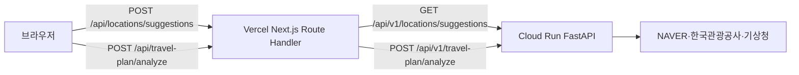

# Travel Congestion Vercel 프론트엔드 PRD

- 문서 성격: 기존 `mobile/` 기능을 웹 브라우저에서 제공하기 위한 프론트엔드 제품 요구사항
- 상태: 구현·검증 반영본
- 작성 기준일: 2026-08-28
- 목표 배포: Vercel
- 목표 디렉터리: `frontend/`
- 백엔드: Google Cloud Run에 배포된 FastAPI
- 기준 문서: [모바일 PRD](mobile-prd.md), [API 계약](api.md), [상세 데이터 계약](3-erd.md)

## 1. 배경과 목적

현재 제품은 Expo 기반 Android·iOS 앱으로 구현되어 있으나 App Store 심사가 지연되고 있다. 앱 설치나 스토어 승인을 기다리지 않고도 사용자가 여행계획을 분석할 수 있도록, 모바일에서 확정한 핵심 흐름을 웹 프론트엔드로 제공한다.

웹 프론트엔드는 모바일의 기능·문구·데이터 의미를 유지하되, 브라우저에 맞는 반응형 레이아웃과 키보드·마우스·스크린리더 UX를 제공한다. 분석 결과의 실제 데이터는 이미 배포된 Cloud Run API에서 조회하고, 웹 지도 타일·경로·마커는 브라우저에서 Naver Maps JavaScript SDK로 표시한다. 웹 프론트엔드는 외부 공공데이터와 Naver 주소 검색·경로 REST API를 직접 호출하지 않으며, 장소 추천·분석 요청은 동일 출처 BFF를 거친다.

## 2. 제품 목표

### 2.1 목표

- 설치 없이 모바일·데스크톱 브라우저에서 여행 분석을 완료한다.
- 여행일, 출발지, 여행지와 선택 조건을 입력하고 장소명 후보를 선택할 수 있다.
- Cloud Run 분석 API의 경로, 행사 밀집 가능성, 방문객 참고값, 날씨와 경고를 해석해 표시한다.
- 모바일과 같은 데이터 한계 고지를 유지해 행사 밀집 가능성을 실제 교통 지연 예측으로 오해하지 않게 한다.
- Vercel Preview와 Production에서 동일한 Cloud Run API를 대상으로 회귀 검증할 수 있다.

### 2.2 비목표

- 회원가입, 로그인, 여행계획 저장, 최근 검색 또는 결과 공유 링크
- 브라우저의 `localStorage`, `sessionStorage`, IndexedDB, 쿠키를 이용한 사용자 데이터 보존
- 행사 상세정보 조회·행사 이미지 저장·행사 데이터베이스 구축
- 실제 교통량, 평균속도 또는 행사로 인한 지연시간 예측
- 지도 SDK를 이용한 주소 검색·분석 REST API 직접 호출
- Cloud Run 서버 키·Naver Maps REST/Local Search Secret을 프론트엔드 번들에 포함
- 로컬 FastAPI를 통합 테스트의 기준으로 삼는 것

## 3. 구현 경계와 주요 결정

### 3.1 별도 웹 앱

웹은 `frontend/`에 독립적인 TypeScript·Next.js App Router 앱으로 구성하고 Vercel에 배포한다. `mobile/`의 Expo Router와 네이티브 지도 의존성을 웹 앱의 런타임에 가져오지 않는다.

다음 항목은 모바일 구현에서 동작 기준으로 재사용한다.

- 입력 검증 규칙: `mobile/src/state/validation.ts`
- API 타입·Enum·응답 구조: `mobile/src/api/contracts.ts`
- API 오류 분류와 요청 제한시간: `mobile/src/api/client.ts`
- 결과 문구·상태 레이블: `mobile/src/ui/presentation.ts`
- 색상·간격·반경 토큰: `mobile/src/theme.ts`
- 네이티브 지도 경로·마커·경계 계산: `mobile/components/RouteMapPreview.native.tsx`

웹 앱은 React Native 컴포넌트를 직접 import하지 않고, 위 규칙을 웹 컴포넌트와 테스트로 옮겨 계약 드리프트를 방지한다.

### 3.2 동일 출처 BFF 프록시

현재 백엔드는 모바일 클라이언트 전제로 구성되어 있고 브라우저 CORS 허용을 계약으로 정의하지 않았다. 브라우저가 Cloud Run을 직접 호출하지 않도록 Next.js Route Handler를 동일 출처 BFF로 사용한다.



BFF의 원칙은 다음과 같다.

- `CLOUD_RUN_API_BASE_URL`은 Vercel 서버 환경변수로만 설정한다.
- `NEXT_PUBLIC_` 환경변수로 Cloud Run URL이나 서버 키를 노출하지 않는다.
- 허용된 두 upstream 경로만 프록시하고, 임의 URL·임의 메서드 프록시는 제공하지 않는다.
- 분석 요청과 장소 검색 요청 본문을 서버 로그에 기록하지 않는다.
- 응답에는 `Cache-Control: no-store`를 적용하고, Vercel·브라우저 캐시가 여행 정보를 저장하지 않게 한다.
- 브라우저 취소 신호를 upstream `fetch`에 전달하고, 기본 프론트 제한시간은 55초로 둔다.
- Cloud Run은 현재 공개 접근 가능한 서비스이므로 별도 브라우저 토큰을 만들지 않는다. 인증 정책이 바뀌면 서버 전용 인증 방식으로만 확장한다.

### 3.3 현재 계약에서 웹 플랫폼 표현

현재 Cloud Run의 `clientPlatform` 허용값은 `IOS`와 `AND`뿐이며 관광공사 API의 `MobileOS` 값으로 전달된다. MVP 웹은 계약을 깨는 `WEB`을 보내지 않고 `AND`를 호환값으로 명시해 전송한다. 이 값은 사용자 화면에 표시하지 않는다.

향후 백엔드가 `WEB`을 공식 지원할 때에만 백엔드·모바일 타입·문서·배포 Revision을 함께 변경한다. 배포된 현재 Cloud Run을 대상으로 하는 MVP에서는 프론트가 임의로 `WEB` Enum을 추가하지 않는다.

## 4. 사용자와 핵심 흐름

### 4.1 대상 사용자

- 여행 전 목적지 주변 행사 여부를 빠르게 확인하려는 사용자
- 앱 설치가 어렵거나 App Store 승인 전 웹 링크로 접근하는 사용자
- 모바일 브라우저를 주로 사용하되 데스크톱에서도 결과를 확인해야 하는 사용자

표시 언어는 한국어이며 날짜·시간은 대한민국 현지 기준으로 표시한다.

### 4.2 핵심 흐름

```text
웹 접속
  → 여행 분석 화면
  → 여행일·출발지·여행지·선택 조건 입력
  → 장소명 입력 시 후보 검색 및 사용자 선택
  → 클라이언트 검증
  → /results로 이동하며 분석 요청
  → 로딩 / 취소 / 성공 / 오류 상태
  → 결과 확인 후 새 분석
  → 안내·출처·비저장 정책 확인
```

후보가 여러 개인 장소명을 자동으로 선택하지 않는다. 후보 검색이 실패해도 사용자가 도로명 주소를 직접 입력해 분석을 계속할 수 있다.

## 5. 정보 구조와 라우팅

| 경로       | 화면      | 요구사항                                                            |
| ---------- | --------- | ------------------------------------------------------------------- |
| `/`        | 여행 분석 | 입력 폼, 빠른 날짜 선택, 장소 후보, 행사 유형, 검증 오류, 분석 시작 |
| `/results` | 분석 결과 | 로딩·취소·성공·오류·결과 없음과 성공 결과의 전체 카드               |
| `/about`   | 안내      | 비저장 정책, 데이터 출처, 등급의 한계, 개인정보 처리방침 링크       |
| 기타       | 404       | 홈으로 돌아가기와 존재하지 않는 경로 안내                           |

`/results`는 입력값이나 결과를 URL query·path에 넣지 않는다. 새로고침하거나 직접 접속했을 때 메모리에 분석 결과가 없으면 “분석할 여행 계획이 없어요” 화면을 표시한다.

## 6. 여행 분석 입력 요구사항

### 6.1 입력 필드

| 항목           |   필수 | 규칙                                         | 웹 UX                                            |
| -------------- | -----: | -------------------------------------------- | ------------------------------------------------ |
| 여행일         |     예 | `YYYY-MM-DD`, 실제 존재하는 날짜             | 접근 가능한 date 입력과 오늘·내일·일주일 후 버튼 |
| 출발지         |     예 | trim 후 1~200자                              | 장소명 후보 또는 주소 직접 입력                  |
| 여행지         |     예 | trim 후 1~200자                              | 장소명 후보 또는 주소 직접 입력                  |
| 출발 예정 시각 | 아니오 | `HH:mm`                                      | time 입력, 분석 참고용 고지                      |
| 관심 행사 유형 | 아니오 | 축제·공연·스포츠·전시·박람회·문화, 최대 10개 | checkbox 또는 chip, 선택 개수 표시               |

초기 여행일은 모바일과 같이 다음 날로 설정할 수 있으며, 실제 구현 시 오늘 날짜를 KST 기준으로 계산한다. 빠른 선택 버튼은 현재 날짜·내일·일주일 후를 사용한다.

### 6.2 장소 후보

- 입력값 trim 후 2~80자이며 숫자가 포함되지 않은 경우에만 추천을 시도한다.
- 입력이 멈춘 뒤 300ms debounce를 적용한다.
- `POST /api/locations/suggestions`를 통해 최대 5개 후보를 요청한다. BFF가 Cloud Run의 GET API로 변환한다.
- 추천 목록에는 장소명과 도로명 주소(없으면 지번 주소)를 표시한다.
- 사용자가 후보를 선택하면 `roadAddress ?? address ?? name`을 입력값으로 채운다.
- 후보 선택 없이도 입력값이 주소라면 분석 제출을 허용한다.
- 추천 실패·빈 결과·취소는 입력 차단 사유가 아니다. 직접 주소 입력 안내를 표시한다.
- 오래된 응답이 최신 입력을 덮어쓰지 않도록 요청 ID 또는 AbortController를 사용한다.

### 6.3 클라이언트 검증

필드 아래에 한국어 오류를 표시하고, 제출 시 첫 오류 필드로 포커스를 이동한다.

- 여행일 형식 또는 실제 날짜 오류
- 출발지·여행지 미입력 또는 200자 초과
- 출발 예정 시각 형식 오류
- 행사 유형 10개 초과 또는 항목 길이 오류
- 검증 오류가 있으면 Cloud Run 요청을 보내지 않는다.

## 7. 분석 요청과 API 계약

### 7.1 프론트 내부 BFF API

브라우저가 호출하는 경로는 Cloud Run의 경로와 구분한다.

| 브라우저 요청                     | 본문                            | BFF upstream                                                                |
| --------------------------------- | ------------------------------- | --------------------------------------------------------------------------- |
| `POST /api/locations/suggestions` | `{ "q": string, "limit": 1~5 }` | `GET {CLOUD_RUN_API_BASE_URL}/api/v1/locations/suggestions?q=...&limit=...` |
| `POST /api/travel-plan/analyze`   | `TravelPlanRequest`             | `POST {CLOUD_RUN_API_BASE_URL}/api/v1/travel-plan/analyze`                  |

BFF는 Cloud Run의 상태 코드와 안전한 JSON 오류 구조를 유지해 클라이언트가 `server`, `network`, `timeout`, `cancelled`, `invalid-response`를 구분할 수 있게 한다. 내부 예외 원문, API 키, upstream 전체 URL은 브라우저 응답에 포함하지 않는다.

### 7.2 분석 요청

```json
{
  "travelDate": "2026-10-03",
  "origin": "서울특별시 용산구 한강대로 405",
  "destination": "부산광역시 동구 중앙대로 206",
  "departureTime": "08:00",
  "clientPlatform": "AND",
  "eventKeywords": ["축제", "공연"]
}
```

웹은 출발지·여행지를 trim하고, 빈 선택값인 `departureTime`은 전송하지 않는다. `eventKeywords`는 공백 제거·중복 제거 후 전송한다. `routeBufferMeters`와 `destinationRadiusMeters`는 사용자 입력으로 노출하지 않고 백엔드 기본값을 사용한다.

상세 필드와 Enum은 [API 계약](api.md)과 `backend/app/schemas/travel_plan.py`를 기준으로 한다. 응답은 웹 클라이언트에서 런타임 구조 검증 후 화면에 전달한다.

## 8. 결과 화면 요구사항

### 8.1 상태 화면

| 상태        | 표시                                               | 동작                                        |
| ----------- | -------------------------------------------------- | ------------------------------------------- |
| `loading`   | 여행 주변을 살펴보는 중, 조회 범위 설명, 진행 표시 | 분석 취소, 중복 제출 방지                   |
| `success`   | 전체 분석 결과                                     | 새 분석, 공식 URL(향후 행사 상세가 있을 때) |
| `error`     | 안전한 오류 제목·문구                              | 다시 시도, 입력으로 돌아가기                |
| `cancelled` | 분석 취소 안내                                     | 입력으로 돌아가기                           |
| 결과 없음   | 분석할 계획 없음                                   | 여행 계획 입력하기                          |

브라우저 탭을 닫거나 새로고침하면 진행 중 요청과 결과를 복원하지 않는다. 분석 요청이 오래 걸릴 때 페이지가 멈추지 않으며, 프론트 제한시간 초과 시 다시 시도 동작을 제공한다.

### 8.2 성공 결과 구성

모바일의 결과 순서를 기준으로 다음 정보를 표시한다.

1. 여행일과 새 분석 버튼
2. 목적지 주변 행사 밀집 가능성 카드
   - `0~2개`: 낮음
   - `3~5개`: 보통
   - `6개 이상`: 높음
   - `nearbyEventCount=null`: 확인 필요
   - `isTrafficPrediction=false`와 “교통 지연 예측 아님”을 항상 표시
   - 서버가 반환한 최대 3개 근거 표시
3. 경로 미리보기
   - 출발지·도착지 좌표와 polyline을 Naver Maps JavaScript SDK의 지도와 Polyline으로 표시
   - 이벤트 좌표가 응답에 있을 때만 번호 마커 표시
   - 현재 MVP 응답의 `events`는 상세 조회 전까지 빈 배열일 수 있음을 표시
4. 요약 지표
   - 자동차 경로 거리
   - 경로 제공자의 일반 예상 이동시간
   - 목적지 주변 행사 후보 수 또는 확인 필요
5. `warnings` 목록
   - 행사·방문객·날씨 일부 실패와 데이터 한계를 심각도별로 표시
6. 목적지 주변 행사 섹션
   - 행사 개수와 count-only 정책 표시
   - 행사 제공자 실패 시 행사 개수·밀집 가능성 확인 필요 상태 표시
   - 행사 상세정보는 후속 범위임을 명시
7. 방문객 참고값 카드
   - `available`, `no-data`, `failed` 구분
   - 기준일·지역·값·출처·참고 문구 표시
   - `isForecast=false`이며 미래 방문객 예측이 아님을 유지
8. 여행지 날씨 카드
   - `available`, `not-yet-published`, `no-data`, `failed` 구분
   - 요약, 확인 시각, 최대 6개 예보, 기온, 강수확률 표시
9. 데이터 안내와 새 여행 계획 분석 버튼

외부 데이터의 현재 값은 변할 수 있으므로 화면 테스트는 행사 개수·날씨 문구의 특정 숫자나 문장을 고정하지 않고, 계약상 Enum·필드·상태 표현을 검증한다.

### 8.3 데이터 표시 원칙

- `durationSeconds`는 행사로 인한 지연시간이 아니라 자동차 경로 제공자의 일반 예상시간이다.
- 행사 밀집 가능성은 목적지 반경 행사 후보 개수 기반 참고 정보다.
- 행사·방문객·날씨 제공자 일부 실패 시 가능한 결과와 경고를 함께 표시한다.
- “데이터 없음”, “예보 미발표”, “조회 실패”, “확인 필요”를 섞어 쓰지 않는다.
- 이벤트 URL은 `https://` 또는 `http://`의 공식 URL만 안전하게 외부 링크로 연다.
- 사용자 입력을 HTML로 해석하지 않고 일반 텍스트로만 렌더링한다.

## 9. 웹 지도 요구사항

웹은 모바일 네이티브 구현과 동일하게 Naver 지도를 사용하고, 지도 위에 Cloud Run 경로와 행사 위치를 표시한다.

- `https://oapi.map.naver.com/openapi/v3/maps.js?ncpKeyId=...`를 결과 화면에서 비동기 로드한다.
- origin, destination, polyline과 좌표가 있는 행사 위치를 `LatLngBounds`로 묶어 `fitBounds`한다.
- 출발·도착은 라벨이 있는 마커, 경로는 Naver `Polyline`, 행사는 혼잡 신호 색상의 번호 마커로 표시한다.
- 모바일 구현과 동일하게 지도는 드래그 이동이 가능한 참고용 미리보기로 제공하며, 지도 밖에서는 결과 화면을 스크롤할 수 있다. Naver 로고·지도 데이터 저작권 표시는 숨기지 않는다.
- 웹용 client ID가 없거나 등록된 웹 서비스 URL과 일치하지 않으면 빈 화면 대신 기존 좌표 SVG 미리보기로 전환한다.
- Naver Maps Web Dynamic Map을 사용하려면 Naver Cloud Platform Application에서 Web Dynamic Map을 선택하고 `travel-congestion.vercel.app`을 웹 서비스 URL로 등록해야 한다.

## 10. 디자인·반응형·접근성

### 10.1 시각 기준

모바일의 light-first 토큰을 기준으로 웹 CSS 변수로 옮긴다.

- 배경: `#F6F8FB`
- 카드: `#FFFFFF`
- 기본 텍스트: `#172033`
- 보조 텍스트: `#61708A`
- 기본 강조: `#1667D9`
- 성공·경고·위험 상태 색상은 모바일 `theme.ts`와 동일한 의미 체계를 사용

과도한 장식보다 입력과 결과의 계층, 상태 색상, 충분한 여백을 우선한다.

### 10.2 레이아웃

- 320px 이상 모바일 브라우저에서 가로 스크롤 없이 사용한다.
- 모바일에서는 단일 열과 하단 고정이 아닌 일반 흐름의 주요 버튼을 사용한다.
- 데스크톱에서는 최대 콘텐츠 폭을 제한하고 입력·설명과 결과를 읽기 좋은 폭으로 배치한다.
- 결과 화면은 넓은 화면에서 요약·지도를 우선 배치하되, 경고·날씨·방문객 정보의 읽기 순서를 유지한다.
- 키보드가 열려도 입력 필드와 오류 문구가 가려지지 않게 한다.

### 10.3 접근성

- 실제 HTML `label`, `input`, `button`, `fieldset`, `legend`, `nav`, `main`, `section`을 사용한다.
- 오류는 `aria-describedby`와 `role="alert"` 또는 적절한 live region으로 연결한다.
- 장소 후보는 접근 가능한 listbox/option 패턴으로 탐색·선택할 수 있다.
- 체크박스·날짜 빠른 선택·새 분석·취소 버튼을 키보드만으로 사용할 수 있다.
- 포커스 표시, 색상 대비, 44px 이상의 실질적 클릭 영역을 보장한다.
- 분석 진행·성공·실패 상태가 스크린리더에 전달되도록 live region을 제한적으로 사용한다.
- `prefers-reduced-motion` 환경에서 애니메이션을 줄인다.

## 11. 개인정보·보안·캐시

- 입력·결과·후보 목록은 React 메모리 상태로만 유지한다.
- `localStorage`, `sessionStorage`, IndexedDB, 쿠키, URL query/path, 클라이언트 캐시를 사용자 데이터 저장 목적으로 사용하지 않는다.
- Vercel Route Handler와 Cloud Run 요청에 `no-store`를 적용한다.
- 서버 환경변수에는 Cloud Run Base URL을 연결하고, Cloud Run용 NAVER·한국관광공사·기상청 Secret은 Cloud Run에만 둔다.
- 브라우저용 `NEXT_PUBLIC_NAVER_MAP_CLIENT_ID`는 공개 가능한 client ID로만 사용하며, Naver Cloud Platform에서 Production·Preview 웹 서비스 URL을 제한한다.
- BFF는 임의 URL 프록시가 아니며, 허용된 경로와 JSON Content-Type만 처리한다.
- 요청 본문은 백엔드 제한인 64KiB를 넘기지 않도록 프론트와 BFF에서 확인한다.
- 프론트·BFF·테스트 로그에 출발지, 여행지, 좌표, 경로, 분석 결과, 전체 요청 본문을 출력하지 않는다.
- Vercel 운영 로그와 호스팅 처리 범위가 기존 [개인정보 처리방침](privacy-policy.html)과 일치하도록 배포 전에 정책을 갱신한다.
- 분석 결과 페이지는 검색엔진이 개인 입력을 색인하지 않도록 `noindex`를 적용한다.

## 12. Vercel 배포 요구사항

### 12.1 프로젝트 설정

| 항목                  | 기준                                          |
| --------------------- | --------------------------------------------- |
| Vercel Root Directory | `frontend`                                    |
| Framework             | Next.js App Router                            |
| Node.js               | 저장소 `.node-version`의 `22.14.0`과 일치     |
| Build                 | `npm ci` 후 `npm run build`                   |
| API 실행              | Vercel Node.js Route Handler                  |
| 분석 데이터           | 빌드 시 조회하지 않고 사용자 요청 시에만 조회 |
| Production URL        | `https://travel-congestion.vercel.app`        |

### 12.2 환경변수

```text
# Vercel server-only environment variable
CLOUD_RUN_API_BASE_URL=https://travel-congestion-lni2ukneka-du.a.run.app

# Vercel public browser environment variable
NEXT_PUBLIC_NAVER_MAP_CLIENT_ID=replace_with_naver_maps_web_client_id
```

위 URL은 2026-08-28 현재 gcloud에서 확인한 운영 서비스 URL이다. Revision 또는 서비스가 바뀌면 Vercel Production·Preview 환경변수만 갱신한다. 저장소에 URL을 코드로 하드코딩하지 않는다.

Preview는 별도 staging Cloud Run이 준비되기 전까지 동일 운영 Cloud Run을 사용한다. Preview 테스트는 운영 API에 분석 요청을 발생시키므로 테스트 횟수를 제한하고, 운영 데이터에 의존하는 정확한 숫자를 검증하지 않는다.

Production 프로젝트명은 `travel-congestion`으로 사용한다. 정확한 `travel-congestion.vercel.app` 주소는 현재 Production deployment에 alias로 연결하며, 새 Production deployment를 수동으로 배포할 때는 `npx vercel alias set <deployment-url> travel-congestion.vercel.app`으로 alias를 갱신한다.

`NEXT_PUBLIC_NAVER_MAP_CLIENT_ID`는 모바일 `EXPO_PUBLIC_NAVER_MAP_CLIENT_ID`와 동일한 client ID를 사용할 수 있지만, Naver Cloud Platform Application에 Web Dynamic Map과 `travel-congestion.vercel.app` 웹 서비스 URL이 등록되어 있어야 한다. `localhost:3000`에서 테스트하려면 개발용 웹 서비스 URL도 같은 Application에 추가한다.

### 12.3 제한시간과 배포 플랜

Cloud Run 분석 API의 서버 제한시간은 60초이고 모바일 기준 클라이언트 제한시간은 55초다. 사용하는 Vercel 플랜의 Route Handler 최대 실행시간이 이 흐름을 수용하는지 배포 전에 확인한다. 수용하지 못하는 플랜에서는 실제 기능을 숨기고 배포하지 않으며, 비동기 분석 API 또는 브라우저 직접 호출+CORS를 별도 설계한다.

## 13. 테스트 전략

테스트의 통합 기준은 로컬 FastAPI가 아니라 배포된 Cloud Run이다.

### 13.1 테스트 계층

| 계층            | 대상                                                       | 데이터 기준                    |
| --------------- | ---------------------------------------------------------- | ------------------------------ |
| 단위            | 날짜·주소·시각·키워드 검증, 포맷터, 상태 레이블, 좌표 투영 | 고정 fixture                   |
| 컴포넌트        | 입력 폼, 후보 선택, 로딩, 오류, 결과 상태, 비저장          | 고정 fixture와 fetch mock      |
| BFF             | 허용 경로, Content-Type, body 상한, timeout, 오류 전달     | Cloud Run 응답 형태 fixture    |
| Cloud Run smoke | `/health`, 장소 후보, 분석 API                             | 실제 배포 URL                  |
| E2E             | Vercel Preview/Production의 실제 브라우저 흐름             | Vercel이 연결한 실제 Cloud Run |
| 수동 QA         | 모바일·데스크톱 폭, 키보드·스크린리더, 새로고침·취소       | Vercel Preview + Cloud Run     |

외부 제공자 장애·부분 실패·timeout을 실제 운영 API에 인위적으로 발생시키지 않는다. 해당 UI는 백엔드 계약 fixture로 재현하고, 실제 Cloud Run에서는 정상 응답의 구조와 동적 상태값을 확인한다.

### 13.2 Cloud Run smoke 기준

현재 배포 URL에서 2026-08-28에 다음을 확인했다.

- `GET /health` → `200`, `{ "status": "ok" }`
- `GET /api/v1/locations/suggestions?q=서울역&limit=5` → `200`, 후보 5개, 후보의 주소·좌표 구조 확인
- 주소 기반 `POST /api/v1/travel-plan/analyze` → `200`, `route`, `congestion`, `weather`, `warnings` 등 최상위 구조 확인

분석의 행사 개수, 날씨 상태, 경고 수는 외부 데이터·여행일에 따라 바뀌므로 smoke의 고정 성공 조건은 HTTP 상태와 JSON 계약으로 둔다.

### 13.3 대표 E2E 시나리오

1. `/`에 접속해 여행일을 `2026-10-03`으로 설정한다.
2. 출발지에 `서울역`을 입력하고 후보가 표시되면 한 항목을 선택한다.
3. 여행지에 `부산역`을 입력하고 후보가 표시되면 한 항목을 선택한다. 후보 API가 일시적으로 실패하면 도로명 주소를 직접 입력해 핵심 분석을 계속한다.
4. 행사 유형을 선택하거나 비워 둔 채 분석한다.
5. 로딩 상태, 중복 제출 방지, 취소 버튼을 확인한다.
6. 성공 시 등급 카드, 경로 미리보기, 거리·시간·행사 수, 방문객, 날씨, 경고 영역을 확인한다.
7. 결과에서 새 분석을 누르면 입력이 초기화되고 `/`로 돌아오는지 확인한다.
8. `/results`를 새로고침했을 때 이전 결과가 복원되지 않는지 확인한다.

## 14. 완료 조건

- Vercel Production URL에서 `/`, `/results`, `/about`과 새로고침·직접 경로 진입이 동작한다.
- 유효한 입력으로 실제 Cloud Run 분석 API를 호출하고 성공 결과를 표시한다.
- 장소 후보 선택, 직접 주소 입력, 후보 API 실패 fallback이 동작한다.
- loading·cancelled·error·success·결과 없음 상태가 서로 섞이지 않는다.
- 행사 밀집 가능성, 일반 예상 이동시간, 과거 방문객 참고값, 날씨 상태의 의미가 모바일과 일치한다.
- 모바일·데스크톱·키보드 사용에서 핵심 흐름을 완료할 수 있다.
- 브라우저와 Vercel 번들에 서버 API 키가 없고, 사용자 입력과 결과가 영구 저장되지 않는다.
- Vercel의 BFF가 임의 URL 프록시가 아니며 `no-store`, 제한시간, 오류 변환을 적용한다.
- 단위·컴포넌트·BFF 검사와 Cloud Run smoke, Vercel E2E가 통과한다.
- Vercel 호스팅 및 운영 로그 범위가 개인정보 처리방침에 반영된다.

## 15. 후속 확장

- 백엔드에 `WEB` client platform을 추가하고 플랫폼별 데이터 호출 의미를 정식화
- 실제 웹 지도 SDK와 확대·이동·행사 마커 상호작용 검토
- 행사 상세 API가 제공될 때 이벤트 카드·공식 URL·상태 필터 추가
- 별도 staging Cloud Run과 Preview 환경 분리
- 공유 가능한 결과는 개인정보·비저장 정책을 재검토한 뒤 별도 설계
