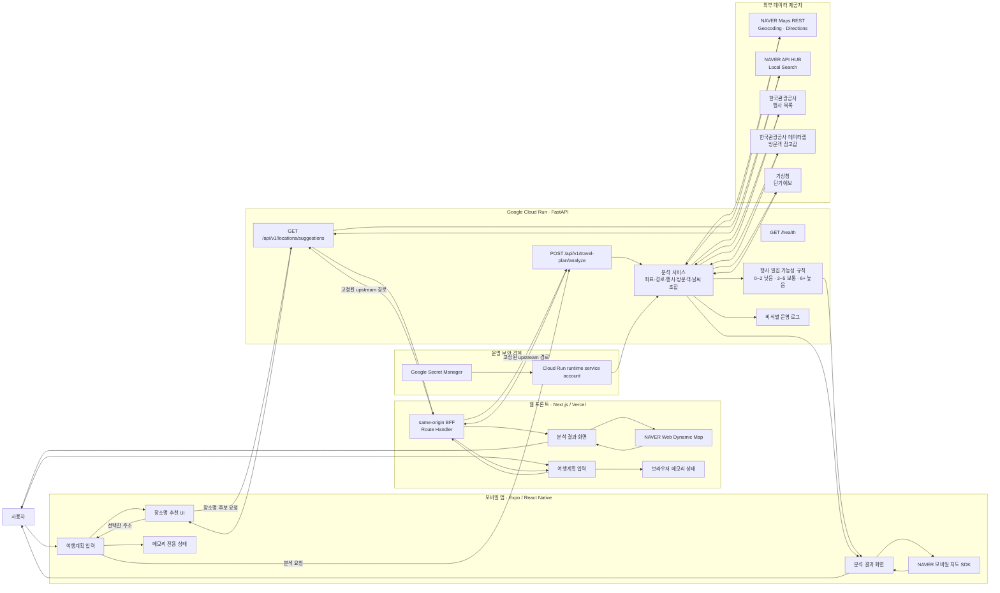
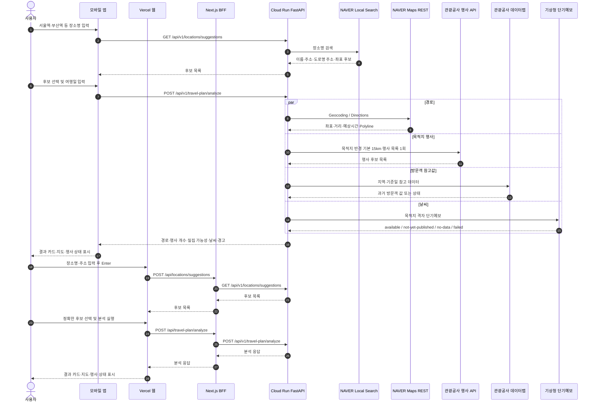

# Travel Congestion 시스템 최종 보고서

- 작성 기준일: 2026-09-04
- 저장소: [TeusEE/tourism-contest](https://github.com/TeusEE/tourism-contest)
- 현재 브랜치: `main`
- 최신 기능 commit: [`53ff7fb`](https://github.com/TeusEE/tourism-contest/commit/53ff7fb42097769d76be34054bd927bba6bb5963)

## 1. 요약

Travel Congestion은 여행일과 출발지·목적지를 입력하면 목적지 주변 행사 밀집 가능성, 자동차 경로, 방문객 참고값, 날씨 정보를 조합해 보여주는 모바일·웹 서비스다.

사용자가 알고 있는 장소명이나 도로명 주소를 입력한 뒤 Enter/Return으로 후보를 확인하고 정확한 장소를 선택할 수 있다. 선택된 도로명 주소를 분석 서버에 전달하고, 서버가 주소를 좌표화한다. 행사 데이터는 목적지 반경 15km를 기본으로 한 번만 조회하고, 현재 MVP에서는 행사 상세정보가 아니라 행사 개수만 사용한다.

웹 프론트는 Next.js App Router와 Vercel로 운영하며, 브라우저는 same-origin BFF를 통해서만 Google Cloud Run API를 호출한다. Production 주소는 [travel-congestion.vercel.app](https://travel-congestion.vercel.app)이다. iOS·Android 스토어 상태는 2026-08-23 마지막 확인 기록 기준으로 iOS `1.0.1 (2)` 심사 진행, Android 최초 수동 업로드 대기 상태이며 최신 스토어 콘솔 상태는 별도 확인이 필요하다.

## 2. 현재 구현 및 배포 감사

2026-09-04 기준 저장소, 모바일 런타임, 웹 Production, Cloud Run 운영 설정을 확인했다.

| 확인 항목                | 결과                                                               |
| ------------------------ | ------------------------------------------------------------------ |
| Git branch               | `main`, `origin/main`과 기능 commit `53ff7fb` 동기화               |
| 최근 기능 변경           | 웹·모바일 주소 후보 선택 UX 개선                                   |
| 웹 Production            | Vercel 배포 `travel-congestion-qdxkx1ygz`, `READY`                 |
| 안정 웹 주소             | `https://travel-congestion.vercel.app`가 최신 Production에 alias됨 |
| Cloud Run                | `travel-congestion-00006-qbv`, 트래픽 100%                         |
| Cloud Run timeout        | 서비스·revision 요청 timeout 120초, 외부 HTTP connect timeout 30초 |
| 실제 `.env` 추적 여부    | 추적하지 않음; `backend/.env`, `mobile/.env`는 ignore 처리         |
| 저장소에 포함된 환경파일 | 키 이름과 placeholder만 있는 `.env.example`                        |

### 앱 런타임에 영향을 주는 현재 설정

- 앱 이름: `Travel Congestion`
- Expo slug: `travel-congestion`
- iOS Bundle ID: `com.travelcongestion.app`
- Android package: `com.travelcongestion.app`
- 앱 버전: `1.0.1`
- iOS/Android production build number 또는 version code: EAS 원격 자동 증가
- iOS 앱 아이콘: `mobile/assets/images/icon-ios-v2.png`
- 서버용 API 키: 모바일 번들에 포함하지 않음

이번 기능 commit에서는 모바일과 웹의 주소 후보 선택 흐름을 함께 개선했으며, 스토어용 native build artifact 자체는 새로 생성하지 않았다. 웹은 GitHub `main` push를 통해 Vercel Production에 자동 배포되었다.

## 3. 시스템 논리구조



## 4. 핵심 분석 흐름



## 5. 주요 기능과 API 계약

### 장소 추천

`GET /api/v1/locations/suggestions?q={query}&limit={1~5}`

- 모바일과 웹 모두 300ms debounce와 이전 요청 취소를 적용한다.
- `서울역`, `부산역`처럼 사용자가 알고 있는 장소명이나 도로명 주소를 NAVER API HUB Local Search로 검색한다.
- 2~80자 입력은 숫자가 포함되어도 추천을 시도하며, Enter/Return을 누르면 debounce 대기 중인 검색을 즉시 실행한다.
- 후보에는 장소명, 지번 주소, 도로명 주소, WGS84 좌표가 포함된다.
- 후보가 표시된 동안에는 분석 폼이 먼저 제출되지 않으며, 사용자가 후보를 클릭하거나 키보드로 선택해야 입력값이 확정된다.
- 후보를 선택하면 `roadAddress ?? address ?? name` 순서로 입력값을 주소로 교체하고, 확정된 값은 다시 추천 요청하지 않는다.
- 빈 결과나 추천 장애가 발생하면 직접 주소 입력과 분석 제출을 허용한다.
- 분석 요청에서 Geocoding이 실패할 경우 백엔드가 Local Search를 fallback으로 사용할 수 있다.

웹 브라우저는 `/api/locations/suggestions`와 `/api/travel-plan/analyze` same-origin Route Handler만 호출한다. BFF는 허용된 Cloud Run 경로로만 변환하고 응답 계약·상태·본문 크기를 검증한다.

### 여행 분석

`POST /api/v1/travel-plan/analyze`

주요 입력값:

- `travelDate`: 여행일
- `origin`, `destination`: 주소 문자열 또는 좌표
- `departureTime`: 출발 예정 시각
- `clientPlatform`: `IOS` 또는 `AND`
- `destinationRadiusMeters`: 행사 검색 반경, 1~20km, 기본 15km
- `eventKeywords`: 행사 유형 키워드

주요 출력값:

- `route`: 출발·도착 좌표, 거리, 예상시간, Polyline
- `nearbyEventCount`: 목적지 주변 행사 개수
- `congestion`: 행사 개수 기반 밀집 가능성
- `visitorReference`: 과거 방문객 참고값
- `weather`: 예보 상태와 요약
- `warnings`: 제공자 장애·미발표·데이터 없음 안내

### 행사 조회 정책

- 목적지 좌표 기준 반경 15km를 기본으로 한다.
- 요청당 목적지 행사 목록 API는 논리적으로 1회 호출한다.
- 여행일·키워드·중복·거리 조건을 서버에서 필터링한다.
- 현재 MVP에서는 행사 상세 API를 호출하지 않는다.
- `events` 상세 목록은 후속 범위이며 현재 의사결정은 `nearbyEventCount`를 기준으로 한다.

### 밀집 가능성 규칙

| 주변 행사 수 | 화면 표기 |
| -----------: | --------- |
|        0~2개 | 낮음      |
|        3~5개 | 보통      |
|     6개 이상 | 높음      |

이 값은 실제 교통 지연 예측이 아니라 목적지 주변 행사 밀집 가능성이다. 응답의 `isTrafficPrediction`은 `false`로 고정한다.

## 6. 모바일 애플리케이션

### 화면 구조

```text
mobile/
├── app/
│   ├── (tabs)/index.tsx       입력 화면
│   ├── results.tsx            분석 결과 화면
│   └── _layout.tsx            Expo Router 레이아웃
├── components/
│   ├── LocationAutocompleteInput.tsx
│   ├── RouteMapPreview.native.tsx
│   ├── RouteMapPreview.tsx
│   ├── EventCard.tsx
│   ├── StatusCard.tsx
│   └── AppButton.tsx / AppTextInput.tsx
├── src/
│   ├── api/                   API client와 계약 타입
│   ├── state/                 메모리 상태·입력 검증
│   └── ui/                    화면 표현 규칙
└── assets/images/             아이콘·스플래시·지도 관련 이미지
```

### 모바일 동작 특성

- Expo Router 기반 입력·결과 화면
- React Context 기반 메모리 전용 상태
- AsyncStorage와 SecureStore를 사용하지 않음
- 분석 요청 timeout: 55초
- 장소 추천 timeout: 8초
- 서버 오류, 네트워크 오류, timeout, 취소, 잘못된 응답을 구분
- iOS와 Android 플랫폼을 요청의 `clientPlatform`에 자동 반영
- 네이티브 NAVER 지도는 경로 확인 중에도 드래그할 수 있고, 화면 세로 스크롤과 충돌하지 않도록 지도 영역의 제스처 경계를 설정
- 장소명·도로명 주소 입력 후 Return으로 후보를 확인하고 후보를 눌러 정확한 주소를 확정
- 실제 서버용 API 키는 앱 번들에 포함하지 않음

### 웹 프론트엔드

```text
frontend/
├── src/app/                  App Router 화면·Route Handler
├── src/components/           입력·결과·Naver 지도 UI
├── src/lib/api/              same-origin client·BFF·계약 guard
└── src/lib/analysis/         브라우저 메모리 상태·입력 검증
```

- Next.js App Router 기반 독립 웹 앱을 Vercel `travel-congestion` 프로젝트로 배포
- Vercel Root Directory: `frontend`, Node.js: `22.x`, install: `npm ci`, build: `npm run build`
- Cloud Run 서버 URL은 Route Handler만 읽는 `CLOUD_RUN_API_BASE_URL`로 주입하고 브라우저에 노출하지 않음
- Naver Maps Web Dynamic Map은 공개 Client ID와 `ncpKeyId`로 로드하며, 인증 실패·SDK 오류에는 좌표 SVG fallback을 사용
- 웹 지도도 `draggable`과 kinetic pan을 활성화해 사용자가 직접 이동할 수 있음
- 입력·분석 결과는 React Context의 브라우저 메모리에만 유지

## 7. 백엔드 애플리케이션

### 모듈 구조

```text
backend/app/
├── api/routes/
│   ├── health.py              /health
│   ├── locations.py           장소 추천
│   └── travel_plan.py         여행 분석
├── clients/
│   ├── naver.py               Maps·Local Search
│   ├── visitkorea.py          행사 API
│   ├── visitor.py             방문객 데이터
│   ├── weather.py             기상청 단기예보
│   └── http.py                공통 Async HTTP client
├── domain/
│   ├── congestion.py          밀집 가능성 판정
│   ├── events.py              기간·거리·중복 필터
│   ├── geometry.py            거리·좌표 계산
│   └── models.py              도메인 모델
├── services/analyzer.py       분석 오케스트레이션
├── schemas/                   Pydantic API 계약
└── core/
    ├── config.py              환경설정·SecretStr
    ├── logging.py             비식별 로그
    └── middleware.py          Request ID·입력 제한
```

### 서버 제한과 장애 처리

- 애플리케이션 기본 분석 timeout: 60초, Production Cloud Run 환경변수: 120초
- Production 외부 HTTP connect timeout: 30초
- 요청 본문 최대 크기: 65,536 bytes
- 분석당 행사 처리 상한: 100개
- 인스턴스 내 외부 호출 동시성: 10개
- 외부 HTTP 재시도는 제한적으로 적용
- 일부 제공자 실패 시 가능한 결과와 `warnings`를 함께 반환
- 요청 본문, 좌표, 경로, 외부 URL, 응답 본문, API 키를 로그에 기록하지 않음
- 사용자 입력과 분석 결과를 영구 저장하지 않음

## 8. 기술 스택

| 영역              | 기술                                  | 사용 목적                           |
| ----------------- | ------------------------------------- | ----------------------------------- |
| 모바일 언어       | TypeScript                            | 앱·API 계약·상태 타입 안정성        |
| 모바일 런타임     | React Native `0.86.2`, React `19.2.3` | iOS·Android 공통 UI                 |
| 모바일 프레임워크 | Expo SDK `57`, Expo Router            | 네이티브 빌드와 파일 기반 라우팅    |
| 지도 SDK          | `@mj-studio/react-native-naver-map`   | 네이티브 지도·Polyline·마커         |
| 모바일 테스트     | Jest, `jest-expo`                     | API 변환·상태·표현 테스트           |
| 모바일 품질       | TypeScript compiler, ESLint, Prettier | 타입·린트·포맷 검사                 |
| 웹 언어·런타임    | TypeScript, React `19.2.8`            | 브라우저 UI·API 계약·상태           |
| 웹 프레임워크     | Next.js `16.3.3` App Router           | Vercel 웹 앱과 same-origin BFF      |
| 웹 지도           | Naver Maps JavaScript SDK             | Web Dynamic Map·경로·마커           |
| 웹 테스트·품질    | Vitest, TypeScript, ESLint            | API/BFF·검증·정적 품질 검사         |
| 웹 배포           | Vercel                                | Production 웹 호스팅·Route Handler  |
| 백엔드 언어       | Python `3.11`                         | 분석 서버                           |
| 백엔드 프레임워크 | FastAPI, Uvicorn                      | REST API와 OpenAPI                  |
| 설정·계약         | Pydantic Settings / Pydantic          | 환경변수·요청·응답 검증             |
| HTTP              | httpx AsyncClient                     | 외부 API 비동기 호출·timeout·재시도 |
| 지리 계산         | pyproj, Shapely                       | 좌표 변환·거리·경로 주변 계산       |
| 백엔드 품질       | pytest, Ruff, mypy                    | 테스트·린트·정적 타입 검사          |
| 컨테이너          | Dockerfile                            | Cloud Run 실행 이미지               |
| 운영 플랫폼       | Google Cloud Run                      | Stateless FastAPI 배포              |
| 보안 저장소       | Google Secret Manager                 | 관광공사·기상청·NAVER 서버 키       |
| 운영 IAM          | Cloud Run runtime service account     | Secret Manager 최소 접근            |
| CI                | GitHub Actions                        | backend·mobile·M4 보안 검사         |
| 모바일 배포       | EAS Build / EAS Submit                | iOS·Android store artifact와 제출   |
| iOS 배포          | App Store Connect                     | `1.0.1 (2)` 제출 및 심사            |
| Android 배포      | Google Play Console                   | 최초 수동 업로드 대기               |
| 문서 배포         | GitHub Pages                          | 개인정보 처리방침 공개              |

## 9. 외부 API와 데이터 사용

| 제공자                     | 연동 기능             | 서버 사용 방식                           |
| -------------------------- | --------------------- | ---------------------------------------- |
| NAVER Maps REST            | Geocoding, Directions | 주소 좌표화와 자동차 경로                |
| NAVER 모바일 지도 SDK      | 지도 렌더링           | 모바일 앱에서 공개 Client ID 사용        |
| NAVER Maps JavaScript SDK  | 웹 지도 렌더링        | Vercel 웹에서 공개 Client ID 사용        |
| NAVER API HUB Local Search | 장소명 추천           | 서버 전용 Client ID·Secret 사용          |
| 한국관광공사 관광정보      | 주변 행사             | 목적지 반경 행사 목록과 개수             |
| 한국관광공사 데이터랩      | 방문객 참고값         | 과거 기준값, 미래 예측으로 표현하지 않음 |
| 기상청 단기예보            | 날씨                  | 목적지 격자 변환 후 예보 상태 표시       |

웹의 공개 Naver Maps Client ID는 `travel-congestion.vercel.app` 도메인으로 제한하고, 서버용 NAVER·공공데이터·기상청 키는 Cloud Run Secret Manager에서만 주입한다.

## 10. 배포·운영 현황

### Cloud Run

- 프로젝트: `travel-congestion`
- 서비스: `travel-congestion`
- 리전: `asia-northeast3`
- 운영 URL: `https://travel-congestion-lni2ukneka-du.a.run.app`
- 최신 Ready Revision: `travel-congestion-00006-qbv`
- 정상 트래픽: 최신 revision에 100%
- `/health`: HTTP 200, `{"status":"ok"}`
- CPU: 1
- 메모리: 512MiB
- Cloud Run 요청 timeout: 120초
- 애플리케이션 `REQUEST_TIMEOUT_SECONDS`: 120초
- 외부 HTTP `REQUEST_CONNECT_TIMEOUT_SECONDS`: 30초
- 인스턴스 동시성: 10
- 최소 인스턴스: 0
- 최대 인스턴스: 1
- 인증: 앱에 고정 토큰을 넣지 않는 공개 API + 서버 입력 제한

### 웹 Production · Vercel

- 프로젝트: `travel-congestion`
- Root Directory: `frontend`
- Node.js: `22.x`
- install/build: `npm ci` / `npm run build`
- 최신 GitHub 연동 Production deployment: `travel-congestion-qdxkx1ygz-teus-ee-s-projects.vercel.app`
- 배포 상태: `READY`
- 배포 commit: `53ff7fb feat: improve location candidate selection UX`
- 안정 주소: [https://travel-congestion.vercel.app](https://travel-congestion.vercel.app)
- 안정 주소 alias가 최신 Production deployment를 가리키는 것 확인
- 브라우저 요청은 same-origin BFF를 거쳐 Cloud Run의 장소 추천·분석 API로 전달

### iOS

- 앱 버전: `1.0.1`
- Build number: `2`
- EAS build: [8d3ad995-d790-4c25-9af3-801e443da4f8](https://expo.dev/accounts/teusee/projects/travel-congestion/builds/8d3ad995-d790-4c25-9af3-801e443da4f8)
- 제출: [f8d6faa8-4f03-4dce-95f6-6496e3accd0e](https://expo.dev/accounts/teusee/projects/travel-congestion/submissions/f8d6faa8-4f03-4dce-95f6-6496e3accd0e)
- 마지막 확인 기록(2026-08-23) 기준 상태: App Store 심사 진행 중

### Android

- 마지막 성공 AAB: `1.0.0 (1)`
- EAS build: [641555d8-741c-4d70-9865-f70cabc170ba](https://expo.dev/accounts/teusee/projects/travel-congestion/builds/641555d8-741c-4d70-9865-f70cabc170ba)
- 마지막 확인 기록(2026-08-23) 기준 EAS 제출: 최초 Google Play 업로드 제한으로 오류
- 남은 단계: `1.0.1 (2)` AAB 생성 → Play Console 최초 수동 업로드 → 내부 테스트

### 개인정보 처리방침

- 공개 URL: [https://teusee.github.io/tourism-contest/privacy-policy.html](https://teusee.github.io/tourism-contest/privacy-policy.html)
- 파일: `docs/privacy-policy.html`
- 주의: 사업자명, 주소, 개인정보 보호책임자 이메일 placeholder를 실제 운영자 정보로 교체해야 한다.

## 11. 품질 검증 현황

- 백엔드 pytest: 43개 통과
- 모바일 Jest: 14개 통과
- 모바일 TypeScript typecheck: 통과
- 모바일 ESLint: 통과
- 모바일 Prettier format check: 통과
- 웹 Vitest: 35개 통과
- 웹 TypeScript typecheck: 통과
- 웹 ESLint: 통과
- 웹 Next.js production build: 통과
- M4 보안 검사: 통과
- iOS Simulator: 장소명 추천, 주소 선택, 장거리 분석, 날씨, 지도 결과 확인
- iPhone/iPad 스토어 스크린샷: 각 3개 준비
- 운영 Cloud Run smoke: health 200(134ms), 장소 추천 5개 200(288ms), 분석 200(4687ms)
- Vercel Production `/`, `/results`, `/about`: HTTP 200 확인
- Vercel Production 장소 추천 BFF: `서울역` 후보 5개 반환 확인
- Secret Manager: 5개 서버용 secret 연결 확인
- `main` commit `53ff7fb`가 `origin/main`과 동기화됨

## 12. 남은 작업

### 웹·운영 관련

1. NAVER Cloud Platform에서 `travel-congestion.vercel.app` Web Dynamic Map 도메인 인증 상태를 지속 확인
2. Vercel Production과 Cloud Run의 p50/p95, 오류율, 외부 provider 지연을 모니터링
3. 장소 추천 빈 결과가 많은 도로명 주소 검색은 NAVER Local Search·Geocoding 조합 개선을 검토

### 출시 관련

1. iOS App Store 심사 결과 확인 및 승인 후 출시 처리
2. Android `1.0.1 (2)` production AAB 생성
3. Google Play 최초 수동 업로드 및 내부 테스트
4. Android 개발자 계정 유형에 따라 closed testing 요건 확인
5. Play Console 스토어 등록정보·Data safety·콘텐츠 등급·개인정보 처리방침 입력

### 법무·운영 관련

1. 개인정보 처리방침 placeholder 교체
2. 외부 API 출처·이용약관·스토어 설명 최종 검수
3. Cloud Run 실제 p50/p95, 메모리, 동시 요청 측정
4. Docker 이미지 레이어와 Cloud Run 운영 로그의 최종 secret 노출 검사

### 문서 정리

현재 `docs/2-task_list.md`, `docs/tasks/*.md`의 일부 상태는 2026-08-20 기준으로 작성되어 실제 최신 배포 상태보다 뒤처져 있다. 최신 웹·모바일·Cloud Run·Vercel 상태는 `docs/fe-prd.md`, `docs/fe-task-list.md`, 이 보고서에 반영했다.

## 13. 재현 명령

### 로컬 품질 검사

```bash
cd backend
uv run pytest
uv run ruff check .
uv run mypy app

cd ../mobile
npm run typecheck
npm run lint
npm test -- --runInBand
npm run format:check

cd ../frontend
npm run typecheck
npm run lint
npm test
npm run build
CLOUD_RUN_API_BASE_URL=https://travel-congestion-lni2ukneka-du.a.run.app npm run smoke:cloud-run

cd ..
python scripts/check_m4.py
```

### Android 다음 단계

```bash
cd mobile
eas build --platform android --profile production
```

빌드 결과가 `Version 1.0.1`, `Version code 2`인지 확인한 뒤, AAB를 Google Play Console의 내부 테스트 트랙에 최초 수동 업로드한다.

## 14. 결론

핵심 제품 흐름과 웹 Production 배포, iOS 제출은 완료되었다. 시스템은 모바일 앱, Vercel 웹·BFF, Cloud Run 분석 API, 외부 데이터 제공자, Secret Manager로 분리되어 있으며, 행사 개수 기반 밀집 가능성이라는 MVP 범위를 지킨다.

주소 입력은 장소명·도로명 주소를 그대로 검색하고 Enter/Return 후 후보를 선택하는 흐름으로 웹과 모바일에 통일했다. 웹 지도와 모바일 네이티브 지도 모두 사용자가 드래그할 수 있으며, 운영 Cloud Run은 공공데이터 지연에 대비한 120초 요청 timeout과 30초 connect timeout을 적용한다.

현재 출시를 막는 실질적인 잔여 항목은 Android Google Play 최초 수동 업로드, 개인정보 처리방침 운영자 정보 확정, iOS 최신 심사 결과 확인이다. 웹은 GitHub `main` push와 Vercel Production 자동 배포까지 연결되어 있다.
